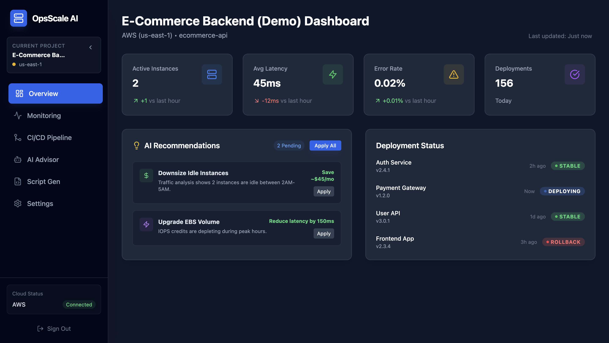
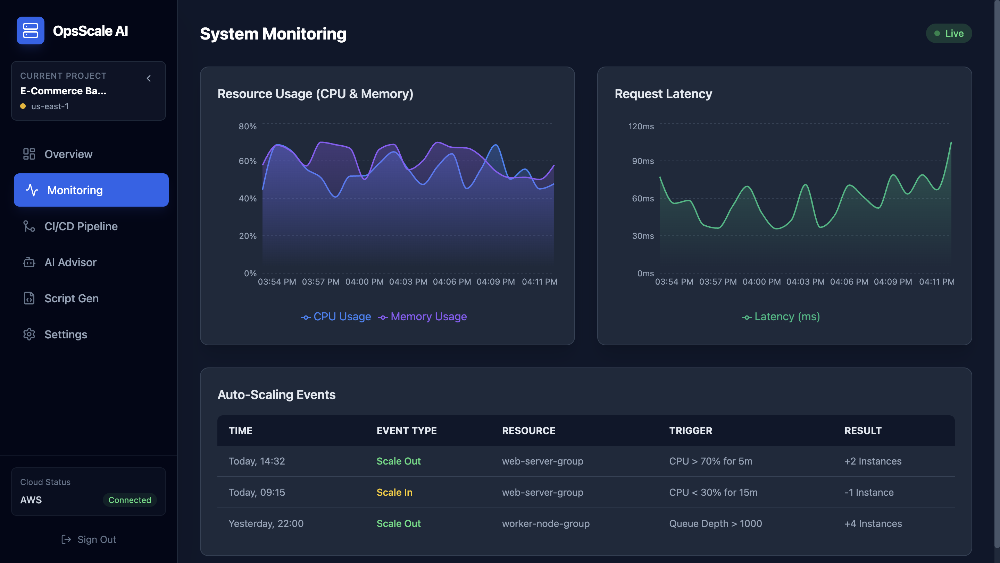
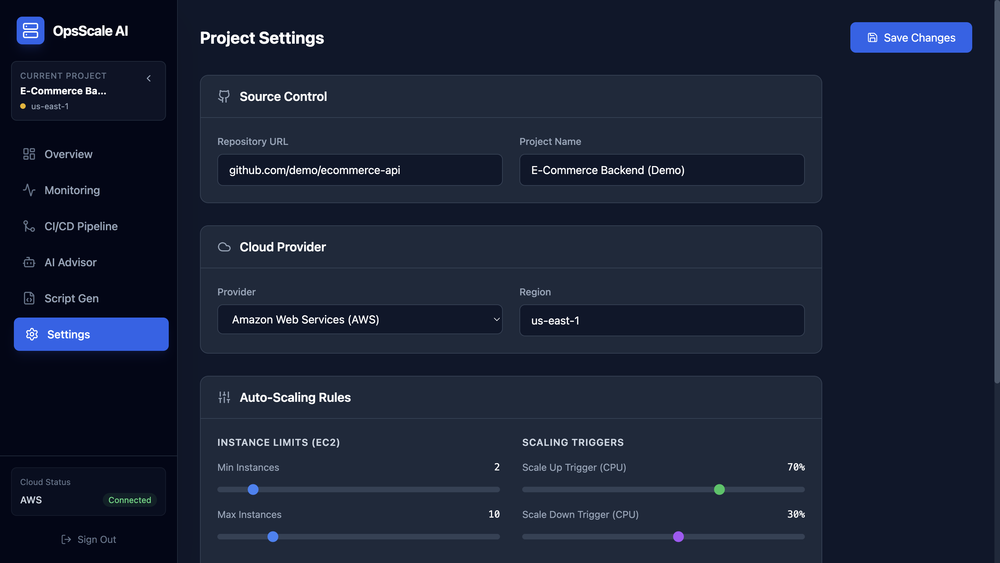
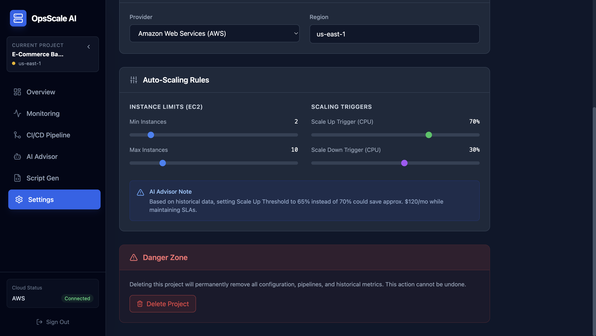

<div align="center">
  
  <h1>OpsScale AI</h1>
  <p><strong>AI-Powered Deployment & Scaling Advisor</strong></p>

  <p>
    Automate deployments, optimize cloud costs, and scale your applications intelligently using AI-driven recommendations.
  </p>

  <a href="https://ops-scale-ai.vercel.app" target="_blank">
    🚀 Live Demo
  </a>
</div>

---

## 📌 Overview

**OpsScale AI** is a modern DevOps productivity platform that helps developers deploy, monitor, and scale their applications using AI-powered insights.

It unifies:

- 🔧 **CI/CD pipelines**  
- 📊 **Infrastructure monitoring**  
- 🤖 **AI scaling recommendations**  
- ⚙️ **Deployment pipeline visualization**  
- 🧱 **Infrastructure-as-Code generation** (Dockerfile, GitHub Actions, Terraform, Kubernetes Manifests)  

All inside a clean, dark, cloud-native dashboard built with **React + TypeScript + Vite**.

---

## ✨ Features

### 💠 Intelligent Scaling Advisor
- Detects CPU/memory usage trends  
- Suggests scale-in/out strategies  
- Provides cost-saving optimization tips  
- Auto-generates scaling rules

### 🚀 CI/CD Pipeline Viewer
- Visual timeline of build → test → deploy stages  
- Realistic logs viewer  
- “Simulate Failure” mode  
- Trigger deployments manually

### 🔍 Monitoring Dashboard
- CPU / Memory trend graphs  
- Request latency analysis  
- Auto-scaling events timeline  
- Real-time "Live" indicators

### 🏗 Script Generator
Generate production-ready IaC scripts using Gemini AI:
- Dockerfile
- GitHub Actions workflow
- Terraform AWS config
- Kubernetes Deployment / Service YAML

### 🗂 Project Workspace
- Multiple projects  
- Connect repos & cloud providers  
- Region-based deployment settings  
- Per-project scaling limits

---

## 🖥️ UI Preview

<p align="center">
  
</p>

<p align="center">
  
</p>

<p align="center">
  
</p>

<p align="center">
  
</p>

<p align="center">
  
</p>

<p align="center">
  
</p>

<p align="center">
  
</p>

<p align="center">
  
</p>

<p align="center">
  
</p>


## 🛠 Tech Stack

### **Frontend**
- React (TypeScript)
- Vite
- TailwindCSS
- Zustand *(if used)*
- Chart.js / Recharts *(for monitoring graphs)*

### **AI**
- Google Gemini API
- Prompt-engineered recommendations
- Structured outputs for:
  - Scaling guidance
  - Cost optimization
  - Infrastructure selection

### **Deployment**
- Vercel

### **State & Data**
- Local state + mock project data
- Placeholder for backend integration (future update)

---

## 🧱 Folder Structure

```bash
src/
 ├─ components/
 │   ├─ dashboard/
 │   ├─ monitoring/
 │   ├─ pipeline/
 │   ├─ ai-advisor/
 │   └─ script-gen/
 ├─ services/
 │   └─ geminiService.ts
 ├─ types.ts
 ├─ App.tsx
 └─ main.tsx
```

## ⚙️ Environment Variables

Create a **`.env.local`** file in the project root:

```bash
VITE_GEMINI_API_KEY=your_key_here
```

⚠️ Never commit this file.
It contains sensitive API keys and must remain private.

🧪 Running Locally
```bash
git clone https://github.com/aaronjames18005/OpsScale-AI.git
cd OpsScale-AI
npm install
npm run dev
```

Then open:
```bash
http://localhost:5173
```

## 🧭 Roadmap
- Real backend with user authentication
- Live CloudWatch / Datadog metrics ingestion
- Real CI/CD pipeline parsing
- Cloud cost estimation dashboard
- Team collaboration (roles, permissions)
- Infrastructure drift detection
- AI-powered troubleshooting for errors & logs

## 🧑‍💻 Author

Aaron James
- <a href="https://www.instagram.com/avtracks?utm_source=ig_web_button_share_sheet&igsh=ZDNlZDc0MzIxNw==" target="_blank"> Instagram </a>
- <a href="" target="_blank"> Portfolio </a>
- <a href="https://www.linkedin.com/in/aaron-james-9703a6388/" target="_blank">LinkedIn </a>
